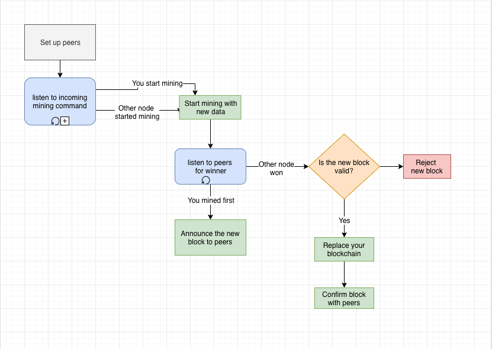

# Blockchain Project

Link to project description [here](https://github.com/datsoftlyngby/soft2018fall-si-teaching-material/blob/master/Slides/12-Blockchain_Intro.ipynb)

## Process flow chart



# Minimal Blockchain Project

The projects implements a minimal viable blockchain technology in Node.js. It is based on the fundamentals of Bitcoin where peers connect to each other and mine in a race to create the next block in the blockchain.

## Get started

This section it will help you get started with running and understanding our implementation. The initial idea was to provide a shell script that will start up all the miners. However, these nodes have to run on sub shells processes and commands are passed on in the console via standard input. Therefore, the following walkthrough	will provide a quick understanding of how to run the system.

There is two way to run the project.

### Using the Docker image provided in the project

1. First build the image from the Dockerfile in the root of the project:

`docker build -t blockchain-node .`

2. Now let’s run this image in detached mode:

`docker run -d blockchain-node`
This returns the container ID. Copy that into the clipboard as we’ll need it in the next step.

3. Attach to the docker container in interactive mode:

`docker exec -it <CONTAINER_ID> bash`

4. Create a miner (node) in the sub-shell inside the container. 

`node src/app.js localhost:5000`

Open a new terminal window and repeat steps 3 and 4 to create more miners. For each new miner increase the port by one in step 5. (E.g `localhost:5001`, `localhost:5002`

### Locally with Node.js installed

You will need `node.js` and `npm` installed.

At the root of the project, perform step 4 from the guide above.

## The nodes

Thanks to the automatic peer discovery we have implemented with the help of npm libraries, peers will find each other automatically	when a new node starts up on the network. They all keep track of each other and communicate via a TCP connection.

The following commands can be executed on the nodes. Type it in the console of the node.

### Broadcast a message to all connected peers

In order to verify that the peers have successfully connected you can broadcast a message by typing some text in the console of the node and press enter. This will be sent to all the connected peers and printed out on standard output.

### See your version of the blockchain

Command: `blockchain`

Type `blockchain`  inside your node to see your current version of the blockchain. In the beginning you will only see the genesis block:

```
[ Block {
    index: 0,
    hash: '0000869bdae234d6628706fc1748d4ece869c9cc8a824bda3b8349085c1bf2b9',
    previousHash: '0000000000000000000000000000000000000000000000000000000000000000',
    timestamp: '1543944440996',
    data: 'Genesis block',
    difficulty: 4,
    nonce: 164239 } ]
```

### Mine a new block

Start mining a new block and announce it to your peers by typing:
`mine: data in new block`
The text after the semi-colon will be your data in your new block.

The output will verify that the node has communicated to all peers the mining of a new block. This will trigger other nodes to start mining for the new block as well - with the exact same data. 

The nodes will now start computing the hash of the data in the block trying to find a nonce value where the hash starts with 5 leading integers (like 55555 or 22222). In order for the nodes to not finish approximately in the same time (by looking for the same nonce value), they are randomly assigned a number between 0-9 that will be the required leading integer for the hash of the block.

When a node finds such a nonce value it announces it to everyone on the network and they will stop the mining process. Now each verifies the integrity of the new block. This includes the value of the index, the previous hash and the data of the whole block hashed to see if the hash value indeed starts with the required 5 leading integers.

Upon successful confirmation, the nodes will each update their version of the blockchain with the newly received block. If any of the validation criteria is not fulfilled, they will not update their blockchain. This way ensuring no tampering has happened with the data or history.

## Notes

### New peers on the network

When a new node connects to the network each peers sends their version of the blockchain to this guy. It will take the most common blockchain that exists on the network and save it as it’s own version.

### Threads

The logic of the mining process is executed on a separate thread. This is necessary for the p2p connection to keep actively listening as long as the while loop is blocking the event loop. 
